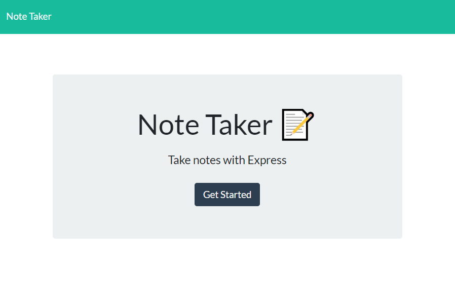
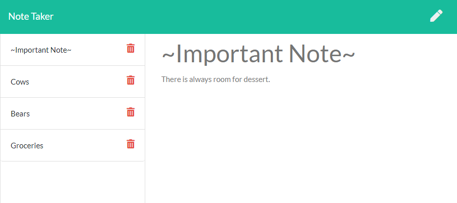

# Express Note Taker

## Description
This [web application](https://arcane-meadow-95494.herokuapp.com/) allows the user to write notes saved to specific titles. Users can save notes that have a title and some content by clicking the save icon in the top right corner of the screen when it appears. Saved notes appear on the left side of the screen, and can be clicked to display in the main note area. Saved notes can also be deleted by clicking the red X to the right side of their title.


## Table of Contents
* [Technologies Used](#technologies-used)
* [How to Access](#how-to-access)
* [What I Did](#what-i-did)
* [Code Snippets](#code-snippets)
* [Screenshots](#screenshots)
* [Acknowledgments](#acknowledgments*)
* [Who I Am](#who-i-am)

---

## Technologies Used
* [Javascript](https://www.javascript.com/) to develop the logic and dynamically-generated HTML included in this web application.
* [Node.js](https://nodejs.org/en/docs/) to run this Javascript program in the terminal/Git Bash console during development.
* [Express](https://www.npmjs.com/package/express) for the use of shorthand methods for developing server code with Javascript.
* [Heroku CLI](https://devcenter.heroku.com/articles/heroku-cli) to use heroku commands in the terminal for deployment to Heroku.
* [Git](https://git-scm.com/) for distributed version control, tracking changes over time and making them visible to collaborators.
* [Github](https://github.com/) for version control in the cloud, saving my changes and presenting them clearly to myself and others.

## How to Access
This web application is hosted on Heroku, and can be [accessed here](https://arcane-meadow-95494.herokuapp.com/), and here: <https://arcane-meadow-95494.herokuapp.com/>

---

## What I Did
I used the Express node package to write code in `server.js` built to interact with the HTML, index.js, and styles.css files at specific endpoints for specific outcomes. When the page is loaded, all notes saved as objects in `db.json` are used to populate the saved notes section on the lefthand sidebar. This is done using a GET request, which the code in `server.js` is prepared to receive via Javascript expressions included in Express. A GET request is also used to load a note to the main note writing section when the user clicks on any of the saved notes in the sidebar. A POST request is issued when the user clicks the save icon for their note, saving their entry to `db.json`. Finally a DELETE request is issued when the user clicks the red X next to any of the saved notes' title, which removes that note from `db.json`.

## Code Snippets 
I was particularly proud of the code below because it took me so long to figure out compared to other sections of code. Wrestling with it was a good time, and was the last thing I needed to complete for the app to function fully.

```javascript
app.delete("/api/notes/:id", function(req, res) {
    var deleteId = req.params.id;
    for (note of db){
        if (note.id === parseInt(deleteId)) {
            db.splice(note, 1);
        }
    }
    res.send("note deleted");
});
```
This is the DELETE response from the backend `server.js` file. The event listener built to call this function is written in `index.js`. In the code, "/api/notes/:id" prepares the function to receive a request to this endpoint, where "id" can be any value since it serves as a parameter for values to follow. In the second line the variable deleteId is declared and set equal to the value of that "id" entered into the query. For each element of the array db (from `db.json`) the id value is parsed into an integer using the parseInt() method, and then compared to the element's id number. If they match, then that note is spliced from the db array. The '1' included as the second argument for splice instructs the method to only remove 1 array element at the location of 'note,' so that not every consecutive element is removed too. The frontend code in `index.js` then uses the modified db array to refresh the saved notes display, with the user's selection properly removed.

## Screenshots
Example of the home page



Example of the notes page


---

## Acknowledgments
* UCB Full Stack Bootcamp for providing starter code for this project.
* [W3Schools](https://www.w3schools.com/) has been my go-to for descriptive tutorials on HTML, CSS, and Javascript syntax and best practices. I am eternally grateful for their massive store of documentation.
* [MDN Web Docs](https://developer.mozilla.org/en-US/) is another resource for documentation on HTML, CSS, and Javascript that I find myself using more and more often as I work through deeper Javascript.
* [Express](https://www.npmjs.com/package/express) deserves another round of thanks for being a really cool way to develop backend code in Javascript.

## Who I Am
My name is Rand Hale, and I am an aspiring programmer/web developer based in California.

* [LinkedIn](https://www.linkedin.com/in/rand-hale-83ba389b/)
* [GitHub](https://github.com/prophetrand)